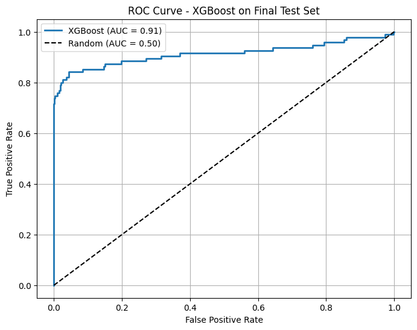
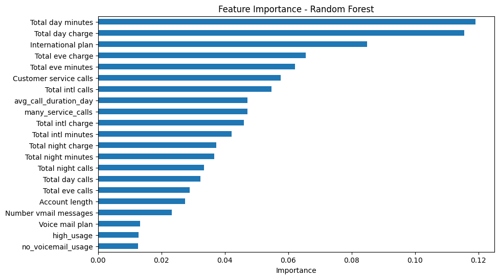
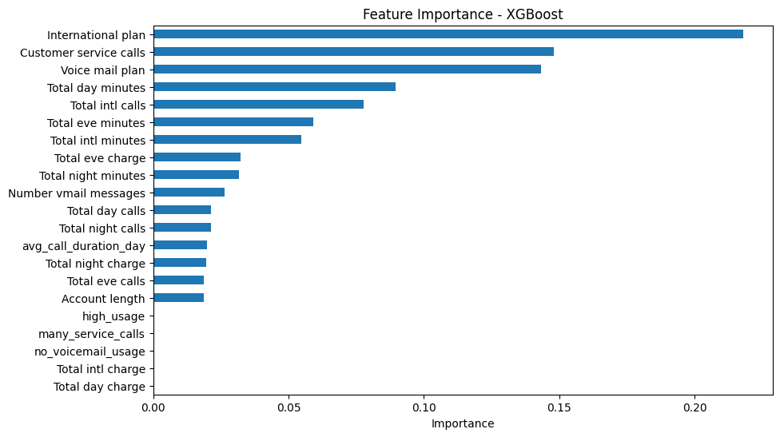

# 客戶流失預測報告書

人工智慧課程專題（113 學年度）

| 姓名 | 學號 | 分工 |
|---|---|---|
| 金蔓均 | 111119045 | 程式 |
| 李恩亞 | 111119042 | 企劃書 |
| 吳采伃 | 111119043 | 企劃書 |

> 本報告所有數字均取自 `customer_analy.ipynb` 的執行輸出，每張表與每張圖下方標示對應的儲存格編號（由上往下計算）。

---

## 一、專題背景

電信業者若能在客戶實際流失前辨識出高風險名單，就能在客戶仍有挽回空間時介入，例如提供續約方案或優先處理其客服需求。本專題使用電信客戶資料集 churn-bigml，比較四種分類模型預測客戶是否流失的表現，並以獨立測試集評估最終模型。

## 二、資料描述

| 項目 | 內容 | 來源 |
|---|---|---|
| 訓練資料 | churn-bigml-80.csv，2,666 筆，20 欄 | 第 2 個儲存格 |
| 測試資料 | churn-bigml-20.csv，667 筆，20 欄 | 第 2、20 個儲存格 |
| 缺失值 | 全部欄位皆無缺失值 | 第 1 個儲存格 |
| 測試資料組成 | 流失 95 筆，未流失 572 筆 | 第 21 個儲存格（混淆矩陣） |

測試資料全程未參與模型訓練與參數調整，只用於最終評估。

## 三、資料前處理與特徵工程

程式碼來源為第 13 個儲存格（訓練資料）與第 18 個儲存格（測試資料）。

**類別欄位轉換**

| 欄位 | 原始值 | 轉換後 |
|---|---|---|
| International plan | Yes / No | 1 / 0 |
| Voice mail plan | Yes / No | 1 / 0 |
| Churn | True / False | 1 / 0 |

**移除欄位** State、Area code

**新增衍生特徵**

| 欄位 | 程式中的定義 |
|---|---|
| many_service_calls | 客服通話次數大於 3 次為 1，否則為 0 |
| no_voicemail_usage | 未申辦語音信箱且語音留言數為 0 時為 1 |
| avg_call_duration_day | 白天通話總分鐘數除以白天通話次數 |
| high_usage | 白天通話分鐘數高於訓練資料平均時為 1 |

**標準化** 以 StandardScaler 處理 8 個連續欄位，包括 Account length、Number vmail messages、Total day minutes、Total eve minutes、Total night minutes、Total intl minutes、Customer service calls、avg_call_duration_day。測試資料使用訓練資料擬合的 scaler 轉換，high_usage 的門檻也使用訓練資料平均，避免測試資訊影響訓練。

## 四、模型比較（驗證階段）

將 churn-bigml-80.csv 以 8 比 2 切分為訓練與驗證資料（random_state=42），比較四種模型。

| 模型 | 主要參數 |
|---|---|
| Logistic Regression | max_iter=1000 |
| K-Nearest Neighbors | n_neighbors=5 |
| Random Forest | n_estimators=100, random_state=42 |
| XGBoost | eval_metric='logloss', random_state=42 |

**表一 驗證資料評估結果**

| 模型 | Accuracy | Precision | Recall | F1-score | ROC AUC |
|---|---|---|---|---|---|
| Logistic Regression | 0.875 | 0.650 | 0.329 | 0.437 | 0.841 |
| K-Nearest Neighbors | 0.848 | 0.417 | 0.063 | 0.110 | 0.606 |
| Random Forest | 0.948 | 0.964 | 0.671 | 0.791 | 0.914 |
| XGBoost | 0.953 | 0.950 | 0.722 | 0.820 | 0.901 |

資料來源 customer_analy.ipynb 第 13 個儲存格輸出，數值四捨五入至小數第三位。

作為對照，未加入衍生特徵時 XGBoost 的驗證 AUC 為 0.896（第 12 個儲存格輸出），加入後為 0.901。

## 五、超參數調整

以 GridSearchCV 對 XGBoost 進行 5 折交叉驗證，評分標準為 ROC AUC，使用全部 churn-bigml-80.csv 資料。

| 參數 | 搜尋範圍 | 最佳值 |
|---|---|---|
| max_depth | 3, 5, 7 | 5 |
| learning_rate | 0.01, 0.1, 0.2 | 0.2 |
| n_estimators | 100, 200 | 100 |
| subsample | 0.8, 1.0 | 1.0 |

共 36 組參數、180 次訓練，最佳組合的交叉驗證平均 AUC 為 **0.922**。

資料來源 customer_analy.ipynb 第 16、17 個儲存格輸出。

## 六、最終測試結果

以最佳參數的 XGBoost 預測獨立測試資料 churn-bigml-20.csv（667 筆）。

**表二 獨立測試集評估結果**

| Accuracy | Precision | Recall | F1-score | ROC AUC |
|---|---|---|---|---|
| 0.9610 | 0.9726 | 0.7474 | 0.8452 | 0.9135 |

**表三 混淆矩陣**

| | 預測未流失 | 預測流失 |
|---|---|---|
| 實際未流失（572） | 570 | 2 |
| 實際流失（95） | 24 | 71 |

資料來源 customer_analy.ipynb 第 21 個儲存格輸出。

圖一 最終測試集 ROC 曲線，資料來源第 21 個儲存格輸出。

## 七、結論

1. 最終模型在獨立測試集的 AUC 為 0.914。95 位流失客戶中辨識出 71 位，572 位未流失客戶中只有 2 位被誤判為流失。
2. 模型判定為流失時幾乎都正確（Precision 0.973），但仍有 24 位、約四分之一的流失客戶未被辨識。若用於實際挽留，漏抓的客戶代表直接的營收損失，這是下一步最需要改善的地方。
3. 特徵重要性顯示，XGBoost 排名前三為 International plan、Customer service calls、Voice mail plan；Random Forest 排名前三為 Total day minutes、Total day charge、International plan。兩個模型都將是否申辦國際方案列入前三。
4. 四項衍生特徵的效果有限。XGBoost 對 high_usage、many_service_calls、no_voicemail_usage 的重要性為 0；Random Forest 中 avg_call_duration_day 與 many_service_calls 位於中段。加入衍生特徵後，XGBoost 驗證 AUC 僅由 0.896 提升至 0.901。
5. KNN 在四個模型中表現最弱，驗證 Recall 僅 0.063。

圖二、圖三 特徵重要性，資料來源第 13 個儲存格輸出。此為驗證階段、尚未調參的模型。

## 八、限制

1. **Logistic Regression 未收斂**。即使設定 max_iter=1000，第 13 個儲存格仍出現未收斂警告，其驗證結果可能低估此模型的表現。
2. **部分欄位未標準化**。calls 與 charge 系列欄位未納入標準化，對 KNN 這類依賴距離計算的模型可能有影響，本專題未進一步驗證。
3. **驗證階段的標準化時機**。第 12、13 個儲存格在切分訓練與驗證資料前擬合 scaler，驗證指標可能略為樂觀。最終測試集的流程不受此影響。
4. **未處理類別不平衡**，且參數調整以 AUC 為標準，未針對 Recall 最佳化。
5. **特徵重要性來自未調參模型**，不一定與最終模型完全一致。

## 九、未來改進方向（尚未實作）

1. 以 SMOTE 或 class_weight='balanced' 處理類別不平衡，並比較 Recall 的變化。
2. 調整分類門檻，或改以 Recall、F1 作為調參標準。
3. 引入 SHAP 分析個別客戶的預測原因，提供營運端參考。
4. 將所有連續欄位納入標準化，並把 scaler 移到資料切分之後。

## 十、原始碼

1. GitHub https://github.com/meminn422/113-AIClass-Customer-_Churn_Prediction.git
2. Google Colab（完整程式）https://drive.google.com/file/d/1WUCK0DkmD7gosCeTKV6BxV3yLo0zukix/view?usp=sharing
3. Google Colab（GridSearchCV）https://colab.research.google.com/drive/1s0YHZYMCGiUua165rojGPLVUNniCd6fR?usp=sharing
